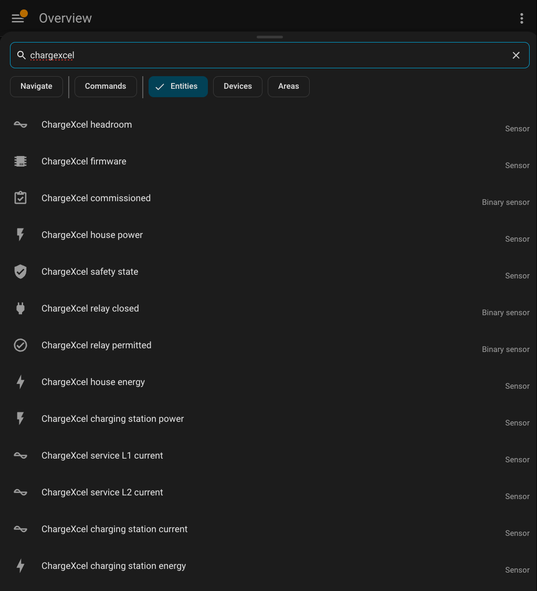

# Using ChargeXcel with Home Assistant

ChargeXcel can be used with [Home Assistant](https://www.home-assistant.io).
This folder has a ready-made package that shows ChargeXcel's live readings and
what it is deciding as Home Assistant sensors, over your home network. No cloud
and no add-ons are needed; it uses Home Assistant's built-in
[RESTful](https://www.home-assistant.io/integrations/rest/) integration.

It is **read-only by design**. Home Assistant can watch ChargeXcel, chart it,
and use it in automations. It cannot open or close ChargeXcel's relay or change
its limits. ChargeXcel keeps protecting your electrical service on its own
whether Home Assistant is running or not.

> ChargeXcel is not a certified "Works with Home Assistant" product, and this
> package is not made or endorsed by the Home Assistant project.

## What you get

| Entity | What it means |
|---|---|
| `sensor.chargexcel_service_l1_current`, `..._l2_current` | Current on each leg of your electrical service, in amps. This is the whole house, including the charging station. |
| `sensor.chargexcel_charging_station_current` | Current the charging station is drawing, in amps. |
| `sensor.chargexcel_headroom` | How many amps ChargeXcel works out the charging station can safely use right now. With net-zero (solar) charging on, this is the lowered figure. It shows *unavailable* while ChargeXcel has no trustworthy figure. |
| `sensor.chargexcel_safety_state` | What ChargeXcel is doing. See the table below. |
| `binary_sensor.chargexcel_relay_closed` | On when the relay is closed and the charging station has power. |
| `binary_sensor.chargexcel_relay_permitted` | On when ChargeXcel's safety logic allows the relay to close. |
| `binary_sensor.chargexcel_commissioned` | On once an electrician has completed setup. |
| `sensor.chargexcel_firmware` | The firmware version running on the unit. |
| `sensor.chargexcel_charging_station_power`, `..._house_power` | Power in watts, worked out from the currents the same way ChargeXcel's own `/energy` page does it. |
| `sensor.chargexcel_charging_station_energy`, `..._house_energy` | Running kWh totals for Home Assistant's Energy dashboard. |

### Safety states

| State | Meaning |
|---|---|
| `RUNNING` | Normal. The service has room, and the charging station may draw power. |
| `SHED_OFF` | The service was near its limit, so ChargeXcel opened the relay to shed the charging load. |
| `RECONNECT_PENDING` | The load has dropped. ChargeXcel is waiting out its reconnect delay before closing the relay again. |
| `READY_OPEN` | Ready, with the relay open. |
| `MANUAL_OFF` | The charging station was switched off from ChargeXcel's own web page. |
| `THERMAL_OFF` | ChargeXcel got too hot and opened the relay. It resumes once it has cooled. |
| `TRIP_LATCHED` | Repeated trips. The relay stays open until the owner clears it on the unit's web page. |
| `SENSOR_FAULT`, `ACTUATOR_FAULT` | ChargeXcel does not trust a sensor or its relay, so it keeps the relay open. |
| `INTERNAL_CT_VERIFYING` | A start-up self-check of its current sensors is in progress. |
| `CONFIG_REQUIRED` | An electrician has not yet completed setup. |
| `BOOT_INHIBITED`, `OTA_INHIBITED` | Starting up, or installing a firmware update. |

## Setup

1. **Get an API key.** Open your ChargeXcel's web page, sign in, go to
   **Menu → API key**, and copy the key. Anyone with this key can read
   ChargeXcel's readings, but it cannot change anything. If you regenerate the
   key, update Home Assistant too.
2. **Find the unit's address.** Every ChargeXcel has its own permanent name,
   `chargexcel-XXXX.local`, where `XXXX` is the last four characters of its
   Wi-Fi setup network name. Your router also lists it as `chargexcel-XXXX`. A
   fixed IP address from your router works too.
3. **Add two lines to `secrets.yaml`.** Keep the quotes around the key.
   Without them, a key that happens to look like a number gets mangled.
   ```yaml
   chargexcel_diagnostics_url: http://chargexcel-XXXX.local/api/diagnostics
   chargexcel_api_key: "paste-the-key-here"
   ```
4. **Turn on packages**, if you haven't already, in `configuration.yaml`:
   ```yaml
   homeassistant:
     packages: !include_dir_named packages
   ```
5. **Copy [`chargexcel.yaml`](chargexcel.yaml)** into the `packages` folder
   next to `configuration.yaml`.
6. **Edit it for your service:**
   - If your service is 120/208 V, change `240` to `208` on the
     charging-station power line.
   - If you have solar panels, delete the house power and house energy
     sensors. ChargeXcel's current sensors can't tell exported power from
     imported, so that figure is not meaningful.
7. **Restart Home Assistant.** The sensors fill in within about 10 seconds.
   ChargeXcel shows up as 13 entities, not as a device, so you won't find it
   on the Devices tab. Press **`e`** anywhere in Home Assistant and search
   **chargexcel** to check they're all there:

   

   The same list is under **Settings → Devices & services → Entities**.
8. **Optional:** in **Settings → Dashboards → Energy**, add
   `sensor.chargexcel_charging_station_energy` as an individual device.

## Good to know

- **Poll rate.** The package asks ChargeXcel once every 10 seconds, which is
  plenty for a dashboard. Please don't go faster than every 5 seconds.
  ChargeXcel's web server handles only a few connections at once, and a fast
  poller can crowd out your browser.
- **Reboots.** The API key survives reboots and firmware updates. The sensors
  show *unavailable* while ChargeXcel restarts and come back on their own.
- **Energy history.** The kWh sensors are Home Assistant's own totals and start
  at zero the day you add them. ChargeXcel keeps its own long-term history on
  its `/energy` page, and as a CSV download from `/api/energy/export.csv`,
  which accepts the same `X-API-Key` header.
- **Older firmware.** The safety-state, headroom and firmware sensors need
  firmware that reports `"schema": 3` or later on `/api/diagnostics`. Older
  firmware still gives you the currents and relay state, and shows the rest
  as *unavailable*.

## The JSON behind it

`GET /api/diagnostics` with header `X-API-Key: <key>`:

```json
{
  "schema": 3,
  "version": "0.9.32",
  "time": {"epoch": 1790000000, "trusted": true},
  "ct": {"service_l1_amps": 31.500, "service_l2_amps": 28.250, "evse_amps": 24.000},
  "relay": {"energized": true},
  "safety": {"state": "RUNNING", "relay_permitted": true},
  "headroom": {"amps": 22.500, "valid": true},
  "electrician": {"valid": true, "service_rating_amps": 100.0, "...": "..."}
}
```

New fields may be added in later firmware. Existing fields keep their names and
meanings, and `schema` goes up when something is added.
